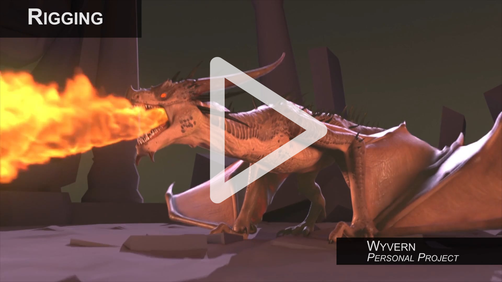

# Lucas Brown - TD

---

| Home | [Resume](resume.md) | [About](about.md) | [Projects](projects.md) |
| ---  | --- | --- | --- |
---

Hi there! I’m a Pipeline TD/Technical artist with experience in full stack 
Python development, pipeline backend/tools, rigging, Pixar USD, and motion 
capture for animation and games. I'm committed to expandable and easily 
deployable systems. I even write docstrings and unittests! 
Motivated and excited to work with supervisors, artists, and programmers to
 create a well oiled, easy to use, CG pipeline.

## <a href="https://vimeo.com/319548283" target="_blank">Reel</a>

| [Resume](resume.md)                                   | [Projects](projects.md)                                   |
|:---:|:---:|
| View or download a PDF of my resume.                  | Check out some of my other work.                         |
| <a href="resume.md" target="_blank">View Resume</a> → | <a href="projects.md" target="_blank">See Projects</a> → |
