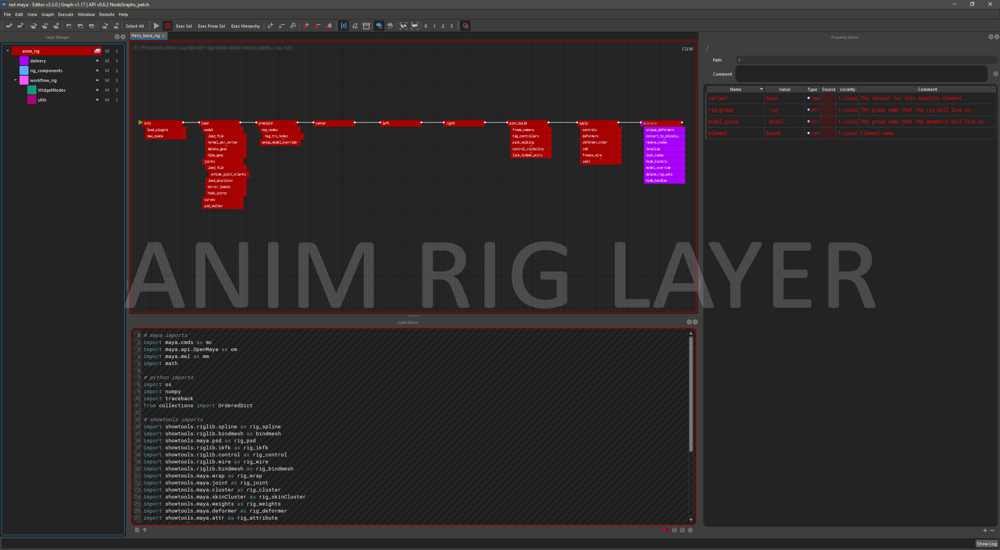

| [Home](index.md) | [Resume](resume.md) | [About](about.md) | Projects|
| --- | --- | --- | --- |
---

### [NXT - Node eXecution Tree](https://sunriseproductions.github.io/nxt/)
**Role:** Lead Developer

**Programming Language:** Python

**Notes:** GUI written using Qt Framework

---

Nxt is a script composition tool designed for rigging, scene assembly, and automation.

The primary function of nxt is to visualize and automate programming tasks 
related to computer graphics and linear processing. Nxt bridges the gap
between one-off scripting and general purpose tools through the use of 
inheritance, layering, and string tokens.

[Learn more!](https://sunriseproductions.github.io/nxt/)

---

